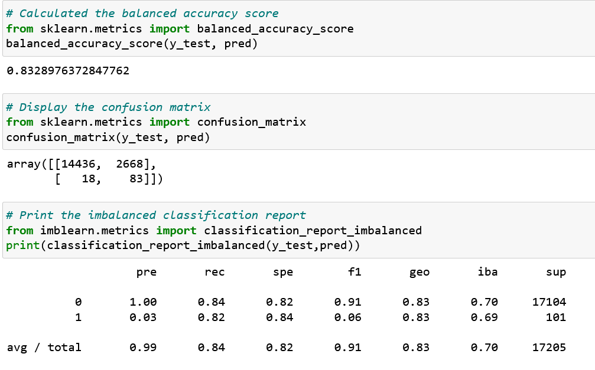
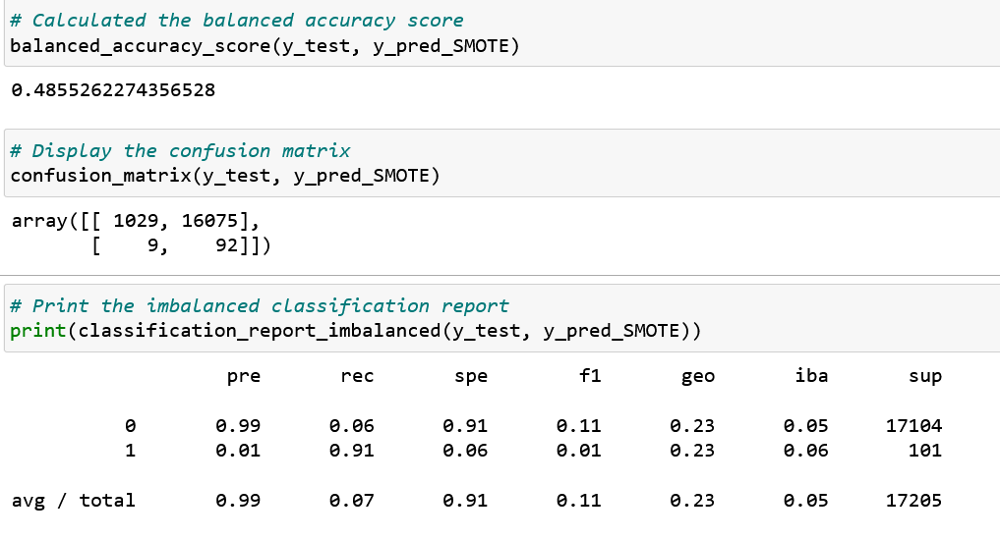
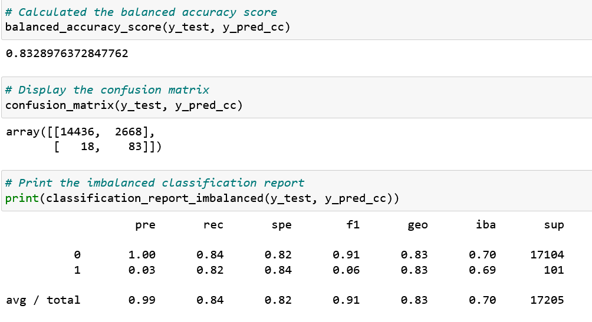
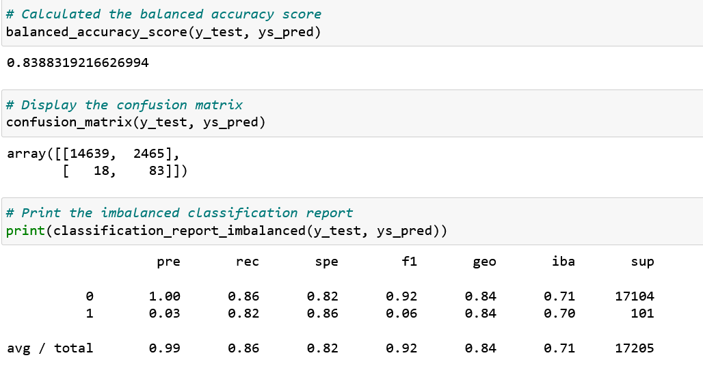
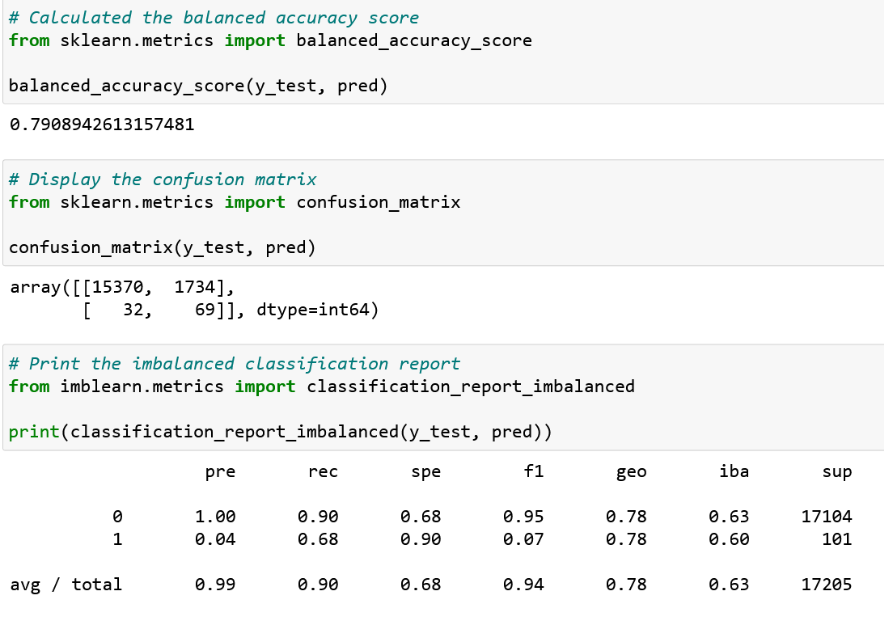
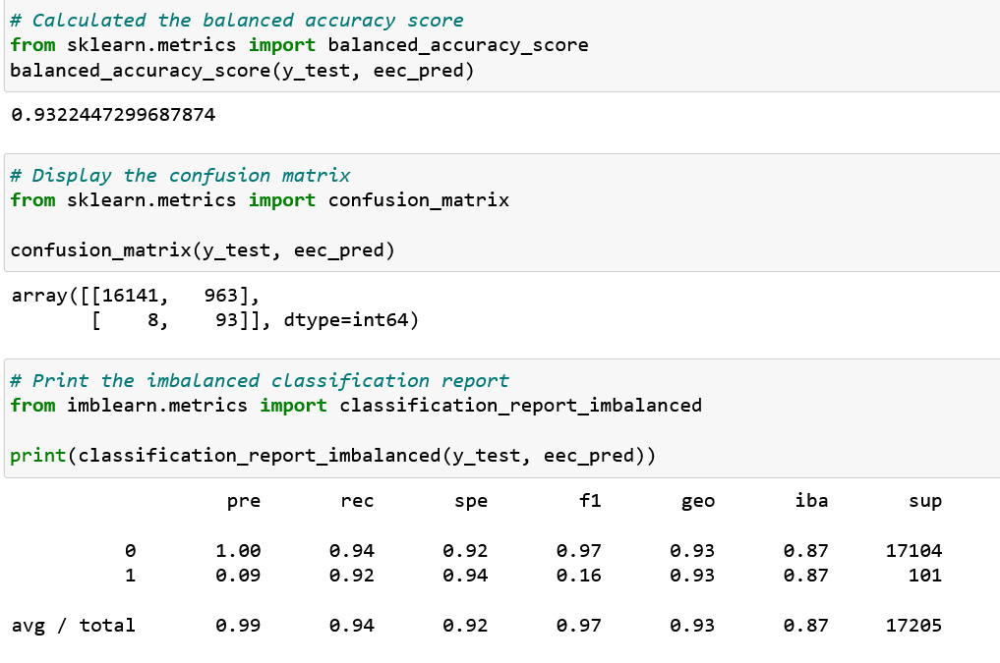
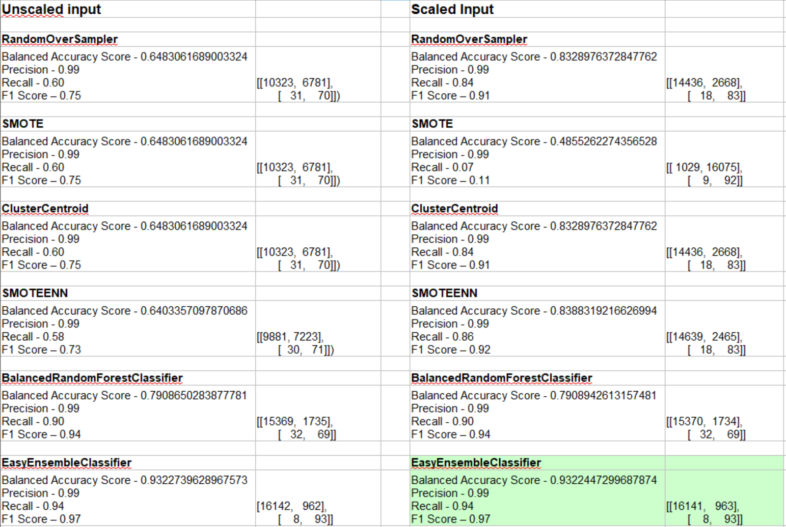
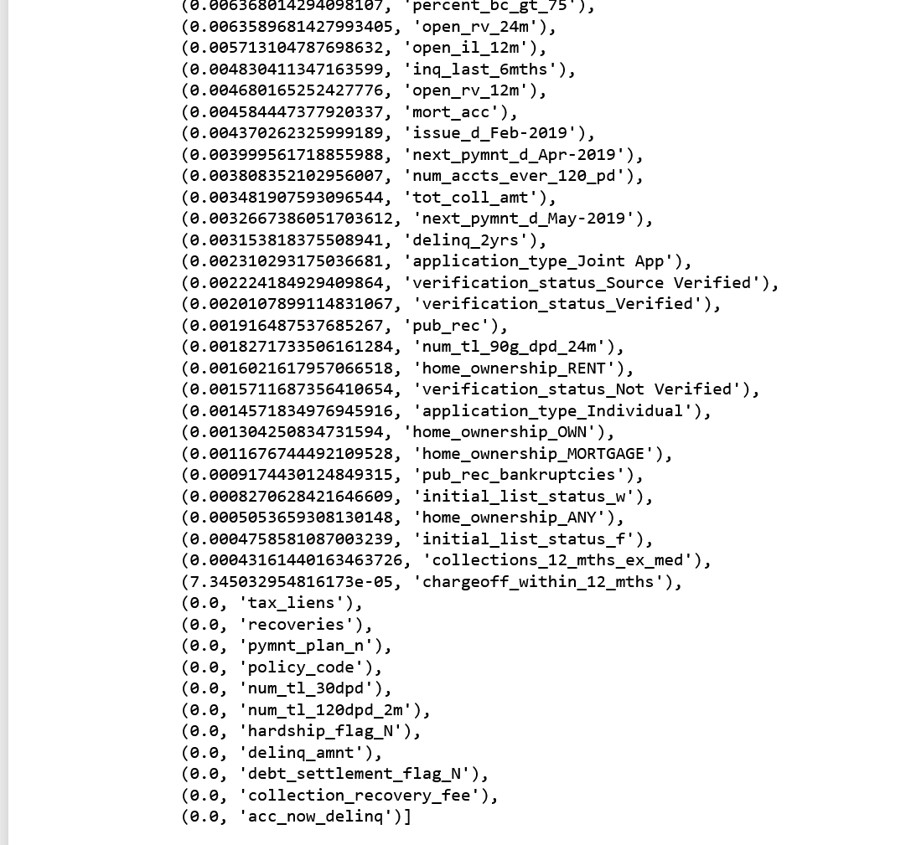

# Credit Risk Analysis via Machine Learning

## Overview of the Analysis
This analysis consisted of a comparison of resampling models and Ensemble classifier models to determine if there was a single model that was best for determining credit risk when presented with an imbalanced dataset.

## Technology
This project included the following technologies:
* Python - The programming language.
* Jupyter Notebook - The web-based interactive computing platform for developing the Python code and executing the models.
* LoanStats_2019Q1.csv - LendingClub.com input data file.
* Resampling models:
    * RandomOverSampler - Oversampling model
    * SMOTE - Oversampling model
    * ClusterCentroids - Undersampling model
    * SMOTEENN - Combinatorial resampling model that employs both over and under sampling methods.
* Ensemble models:
    * BalancedRandomForestClassifier - A balanced decision tree model employing random undersampling.
    * EasyEnsembleClassifier - An ensemble of balanced boosted learners (decision trees). Balancing is via random undersampling.

## Analysis
For both the resampling and ensemble models, the effects of data scaling were explored to determine if this preprocessing activity would generate a noticeable performance impact.

In all cases, the output of the resampling and ensemble models was presented to the LogisticRegression model for performance measurement, that is the ability to use the output data from the resampling/ensemble model to predict whether issuing a loan would pose a risk (bad loan).

Because the LogisticRegression model is classified as a linear model, it was believed that scaled data would benefit all of the input models, but the results revealed that that was not correct in all cases and are presented below.

## Results

### Unscaled input data
* RandomOverSampler

    

    * Balanced Accuracy Score - 0.6483061689003324
    * Precision - 0.99
    * Recall - 0.60
    * F1 Score - 0.75

	
* SMOTE

    

    * Balanced Accuracy Score - 0.6483061689003324
    * Precision - 0.99
    * Recall - 0.60
    * F1 Score - 0.75

* ClusterCentroid

    

    * Balanced Accuracy Score - 0.6483061689003324
    * Precision - 0.99
    * Recall - 0.60
    * F1 Score - 0.75
    
* SMOTEENN

    

    * Balanced Accuracy Score - 0.6403357097870686
    * Precision - 0.99
    * Recall - 0.58
    * F1 Score - 0.73
    
* BalancedRandomForestClassifier

    

    * Balanced Accuracy Score - 0.7908650283877781
    * Precision - 0.99
    * Recall - 0.90
    * F1 Score - 0.94
    
* EasyEnsembleClassifier

    

    * Balanced Accuracy Score - 0.9322739628967573
    * Precision - 0.99
    * Recall - 0.94
    * F1 Score - 0.97

-----

### Scaled input data
* RandomOverSampler

    

    * Balanced Accuracy Score - 0.8328976372847762
    * Precision - 0.99
    * Recall - 0.84
    * F1 Score - 0.91

    
* SMOTE

    

    * Balanced Accuracy Score - 0.4855262274356528
    * Precision - 0.99
    * Recall - 0.07
    * F1 Score - 0.11

* ClusterCentroid

    

    * Balanced Accuracy Score - 0.8328976372847762
    * Precision - 0.99
    * Recall - 0.84
    * F1 Score - 0.91

* SMOTEENN

    

    * Balanced Accuracy Score - 0.8388319216626994
    * Precision - 0.99
    * Recall - 0.86
    * F1 Score - 0.92
    
* BalancedRandomForestClassifier

    

    * Balanced Accuracy Score - 0.7908942613157481
    * Precision - 0.99
    * Recall - 0.90
    * F1 Score - 0.94

    
* EasyEnsembleClassifier

    

    * Balanced Accuracy Score - 0.9322447299687874
    * Precision - 0.99
    * Recall - 0.94
    * F1 Score - 0.97

-----

A spreadsheet comparison was constructed to facilitate model selection.

## Conclusions

From the side-by-side comparison of the model results we can see that there were various models that were affected by the use of scaled input data.

Note that RandomOverSampler, SMOTE, and ClusterCentroid performed almost identically with unscaled input, but SMOTE was nearly crippled by scaled input.  RandomOverSampler and ClusterCentroid both performed better with this scaled dataset.

If we use the F1 scores as the primary selector criteria because of the imbalanced data, then all of the models, with the exception of SMOTE using scaled input, are all valid canddates for consideration in this scenario.

However the EasyEnsembleClassifier had the highest scores in all measurements, and performed slightly better with scaled input. Based on these results, the EasyEnsembleClassifier with scaled input would be the recommended model for determining loan credit risk.

### Future Considerations

During the examination of the BalancedRandomForestClassifier model, the feature importance was explored, and there are many features that make little or no contribution to the output of the model.

In light of this fact, those columns should be removed from the dataset, and the analysis rerun to see if there are further differences that become apparent with a more focused dataset.
