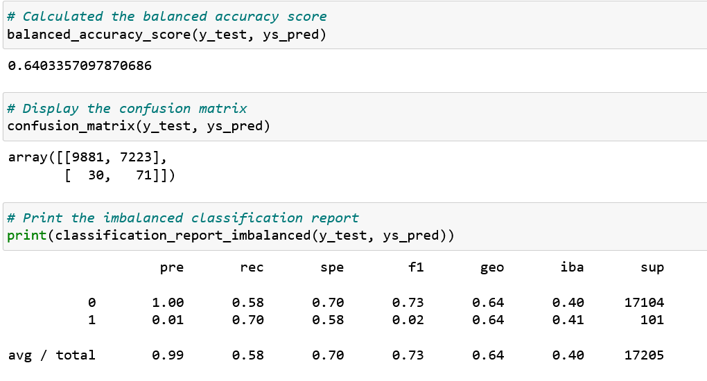

# Credit Risk Analysis via Machine Learning

## Overview of the Analysis
This analysis consisted of a comparison of resampling models and Ensemble classifier models to determine if there was a single model that was best for determining credit risk.

## Technology
This project included the following technologies:
* Python - The programming language.
* Jupyter Notebook - The web-based interactive computing platform for developing the Python code and executing the models.
* LoanStats_2019Q1.csv - LendingClub.com input data file.
* Resampling models:
    * RandomOverSampler - Oversampling model
    * SMOTE - Oversampling model
    * ClusterCentroids - Undersampling model
    * SMOTEENN - Combinatorial resampling model that employs both over and under sampling methods.
* Ensemble models:
    * BalancedRandomForestClassifier - A balanced decision tree model employing random undersampling.
    * EasyEnsembleClassifier - An ensemble of balanced boosted learners (decision trees). Balancing is via random undersampling.

## Results
* RandomOverSampler

    

    * Balanced Accuracy Score - 0.664794698015171
    * Precision - 0.99
    * Recall - 0.61
    * F1 Score - 0.75

    Here we see that about 25% of the positive and negative values are miscalculated, so the F1 score is a better indicator for the power of this model.
    
* SMOTE

    

    * Balanced Accuracy Score - 0.664794698015171
    * Precision - 0.99
    * Recall - 0.61
    * F1 Score - 0.75

    Results are identical to the model above.

* ClusterCentroid

    

    * Balanced Accuracy Score - 0.664794698015171
    * Precision - 0.99
    * Recall - 0.61
    * F1 Score - 0.75

    The Balanced accuracy score is a little lower for this model, but the precision, recall, and F1 scores are all identical to the other resampling models.
    
* SMOTEENN

    

    * Balanced Accuracy Score - 0.6465241180338801
    * Precision - 0.99
    * Recall - 0.57
    * F1 Score - 0.72

    All of the scores for this model are lower than those for ther other resampling models that were examined.
    
* BalancedRandomForestClassifier

    

    * Balanced Accuracy Score - 0.9993861085126285
    * Precision - 1.00
    * Recall - 1.00
    * F1 Score - 1.00

    The Balanced Accuracy Score suggests that this is the right type of model to use for helping to solve this problem, however, the perfect scores for the other measures suggest that there is a problem.  Perhaps the model is overfitting the data and is only successful within this dataset.
    
* EasyEnsembleClassifier

    

    * Balanced Accuracy Score - 1.0
    * Precision - 1.00
    * Recall - 1.00
    * F1 Score - 1.00

    A complete collection of perfect scores casts doubt on the results of this model.  These results suggest that the model is overfitting the data and may not be useful with other datasets.

## Conclusions

Based on the results above, it is not possible to recommend any of these models in this situation.

Three of the four resampler models performed identically. The SMOTEENN model had slightly lower scores, so would not be recommended on that basis.

The decision tree models had almost perfect scores which disqualifies them from consideration, as this indicates overfitting of the training data and subsequent inappropriate analysis for other datasets.

### Future Considerations

During the examination of the BalancedRandomForestClassifier model, the feature importance was explored, and there are many features that make little or no contreibution to the output of the model.

In light of this fact, those columns should be removed from the dataset, and the analysis rerun to see if there is a more conclusive outcome with a more focused dataset.
